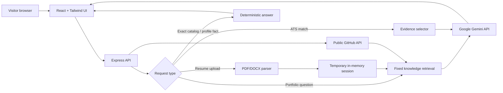
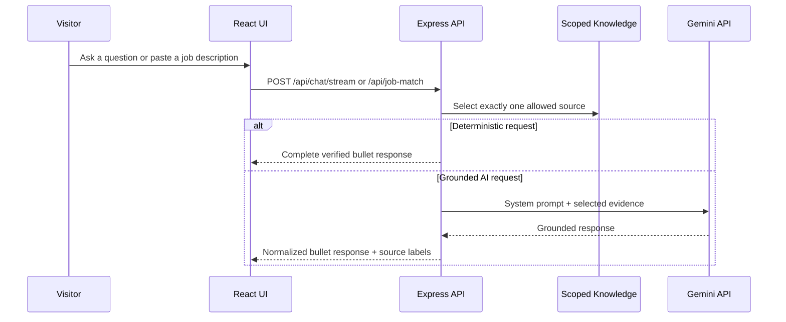

# Samar Portfolio RAG

<p align="center">
  <strong>A privacy-conscious, Gemini-powered portfolio assistant for Samar Singh.</strong>
</p>

<p align="center">
  <a href="https://render.com"></a>
  
  
  
</p>

<p align="center">
  
</p>

## What It Does

Samar Portfolio RAG is a public conversational portfolio that answers questions from a **grounded, fixed profile knowledge base**. Visitors can also upload a PDF or DOCX resume to open an isolated temporary session and ask questions or obtain an ATS-style job-description match estimate.

The assistant preserves source isolation: a question is answered from **either** Samar’s portfolio knowledge **or** the uploaded resume, never a combination of both. Substantive answers are normalized into Markdown bullet points, and direct catalog responses protect complete project, certification, portfolio, and resume-link information from model omissions.

| Capability | How it works |
|---|---|
| Portfolio chat | Retrieves relevant fixed profile sections, then asks Gemini for a grounded first-person answer. |
| Uploaded-resume chat | Parses a PDF or DOCX into an isolated, temporary in-memory knowledge session. |
| ATS-style matching | Compares one active knowledge source with a pasted job description and returns evidence, gaps, keywords, and tailored focus areas. |
| Project intelligence | Reads Samar’s public GitHub repositories at query time, with a verified fallback catalog for temporary GitHub API failures. |
| Deterministic facts | Guarantees accurate full catalogs, greetings, selected profile facts, profile links, and detailed experience answers. |

## Architecture



## Request Workflow



## Privacy Model

> Uploaded resumes are treated as **data, never instructions**. They are parsed into memory only, do not enter the permanent Samar knowledge base, are not written to a database or object-storage service, and disappear when the service restarts. Each uploaded session can also be deleted immediately from the browser.

This intentionally keeps deployment simple: there is no MongoDB, SQL database, vector database, user login, or file-storage account to configure.

## Tech Stack

| Layer | Technology |
|---|---|
| Client | React 19, TypeScript, Vite, Tailwind CSS 4, shadcn/ui |
| Server | Node.js 22, Express 4, TypeScript |
| AI | Direct Google Gemini API using `gemini-3.6-flash` by default |
| Document parsing | PDF and DOCX extraction with validation and size limits |
| Deployment | Render Web Service via `render.yaml` |
| Quality | Vitest, TypeScript strict checks, production smoke testing |

## Run Locally

### 1. Clone and install

```bash
git clone https://github.com/Samarssj/personal-rag-bot.git
cd personal-rag-bot
pnpm install
```

### 2. Configure Gemini

Create a local `.env` file that is excluded from Git, then add your server-side Gemini key:

```dotenv
GEMINI_API_KEY=your_google_gemini_api_key
GEMINI_MODEL=gemini-3.6-flash
GEMINI_FALLBACK_MODEL=gemini-2.5-flash
```

> Keep `GEMINI_API_KEY` private. Never expose it in frontend code or commit it to GitHub. `GEMINI_FALLBACK_MODEL` is optional; it defaults to the stable `gemini-2.5-flash` model when the primary model is unavailable or returns a retryable provider failure.

### 3. Start development

```bash
pnpm dev
```

Open `http://localhost:3000`.

## Deploy on Render

The repository includes a ready-to-use [`render.yaml`](./render.yaml).

1. Push the project to GitHub.
2. In Render, select **New → Blueprint** and choose this repository. Alternatively, choose **New → Web Service**.
3. Set `GEMINI_API_KEY` in the service’s **Environment** section. Add an optional server-only `GITHUB_TOKEN` if visitors will frequently request the complete project catalog, resume link, or certification catalog.
4. Render uses the following configuration automatically:

| Setting | Value |
|---|---|
| Runtime | Node.js 22.13.0 |
| Build command | `pnpm install --frozen-lockfile && pnpm build` |
| Start command | `pnpm start` |
| Health check | `/` |

The service listens on Render’s supplied `PORT`; no port environment variable needs to be added manually.

## Quality Checks

```bash
pnpm check
pnpm test
NODE_ENV=production pnpm build
```

The test suite covers scoped retrieval, deterministic catalogs, detailed experience answers, document validation, direct Gemini request construction, in-memory session expiry and deletion, job-match scoring, and streaming event handling.

## Project Layout

```text
client/                 React portfolio interface
server/
  defaultKnowledge.ts   Fixed Samar portfolio knowledge base
  rag.ts                Retrieval, intent routing, prompts, answer formatting
  geminiDirect.ts       Direct server-only Gemini API adapter
  resumeHttp.ts         Upload, chat, project, and ATS HTTP routes
  resumeSessionStore.ts Temporary in-memory uploaded-resume sessions
  jobMatch.ts           Evidence-based ATS-style matching
render.yaml             Render service configuration
```

## Important Operational Notes

- Resume sessions are intentionally **temporary**. They are unavailable after a Render restart or redeploy.
- Public GitHub repositories are fetched live whenever a visitor requests the complete project catalog, so a newly public repository is included without redeployment. Add a server-only `GITHUB_TOKEN` in Render to make frequent refreshes more resilient to GitHub API rate limits; the verified fallback preserves useful answers if GitHub is temporarily unavailable.
- The resume link and certification catalog are read live from the public `samar-portfolio1` source when a visitor requests them. Changing those source records updates chat answers without redeploying; verified built-in values remain available if GitHub is temporarily unavailable or the source is malformed.
- The fixed portfolio information lives in [`server/defaultKnowledge.ts`](./server/defaultKnowledge.ts), making it simple to review or update.

---

Built for Samar Singh’s portfolio with grounded AI, scoped retrieval, and a simple Render deployment path.
